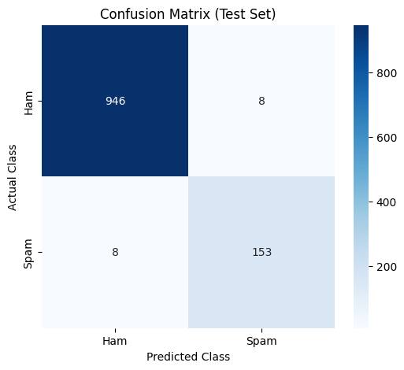

# 📩 SMS Spam Detector


A Machine Learning powered web application that detects whether an SMS message is **Spam** or **Ham** (Normal) with high accuracy (~98%). Built with **Python**, **Scikit-learn**, and **Streamlit**.

This project demonstrates the end-to-end implementation of an NLP pipeline, from data preprocessing (Stemming, TF-IDF) to model deployment using a Support Vector Machine (SVM).

---

## 🖼️ Demo & Visuals

### 🔹 User Interface


### 🔹 Model Performance (Confusion Matrix)
The model minimizes False Positives to ensure important messages are not lost.


---

## 🚀 Key Features

* **Real-Time Prediction:** Instantly analyzes user input to classify messages.
* **Explainable AI:** Highlights suspicious "trigger words" (e.g., *URGENT, FREE, WIN*) to explain why a message was flagged.
* **Batch Processing:** Supports CSV file upload to analyze thousands of messages at once.
* **Dynamic Metrics:** Displays real-time accuracy and recall scores directly from the trained model artifacts.
* **Clean Architecture:** Modular code structure separating training logic (`train_model.py`), application logic (`app.py`), and helper functions (`utils.py`).

---

## 📂 Project Structure

```text
sms-spam-detector/
├── app.py               # Main Streamlit web application
├── train_model.py       # ML Pipeline: Data loading, Preprocessing, Training, Saving
├── utils.py             # Helper module for Text Cleaning & Stemming
├── requirements.txt     # List of python dependencies
├── README.md            # Project documentation
├── data/
│   └── Spam_SMS.csv     # Dataset (UCI SMS Spam Collection + Augmented Data)
├── models/
│   ├── spam_model.pkl   # Serialized SVM Model
│   └── metrics.json     # Saved performance metrics (Accuracy/Recall)
├── assets/
│   └── confusion_matrix.png # Generated evaluation plot
└── notebooks/
    └── EDA.ipynb        # Exploratory Data Analysis (Jupyter Notebook)

```

---

## 🛠️ Installation

Follow these steps to set up the project locally.

### 1. Clone the Repository

```bash
git clone [https://github.com/miraccelikel/Sms-Spam-Detector](https://github.com/miraccelikel/SMS_Spam_Detector).git
cd sms-spam-detector

```

### 2. Create a Virtual Environment (Recommended)

```bash
# For Windows
python -m venv venv
venv\Scripts\activate

# For macOS/Linux
python3 -m venv venv
source venv/bin/activate

```

### 3. Install Dependencies

```bash
pip install -r requirements.txt

```

---

## ⚙️ Usage

### Step 1: Train the Model

Before running the app, you must train the model. This script processes the CSV data, trains the SVM classifier, and saves the model artifacts.

```bash
python train_model.py

```

*Output: You should see "All tasks completed successfully!" and new files in the `models/` folder.*

### Step 2: Run the Web App

Launch the Streamlit interface:

```bash
streamlit run app.py

```

*The app will open in your browser at `http://localhost:8501`.*

---

## 📊 Model Performance

The project uses a **Support Vector Machine (SVM)** with a **Sigmoid Kernel**, optimized for binary text classification.

| Metric | Score | Description |
| --- | --- | --- |
| **Accuracy** | **~98.2%** | Overall correctness of the model. |
| **Spam Recall** | **~97.5%** | Ability to catch actual spam messages. |

> **Note:** High recall is prioritized to ensure that spam messages are effectively filtered out.

---

## 🧪 Data Analysis (EDA)

An extensive **Exploratory Data Analysis** was conducted to understand the dataset. Key insights include:

* **Imbalance:** The dataset is imbalanced (87% Ham vs. 13% Spam).
* **Length:** Spam messages are significantly longer than normal messages.
* **Keywords:** Words like "FREE", "CALL", "TXT", "CLAIM" are dominant in Spam.

*See `notebooks/EDA.ipynb` for detailed charts and word clouds.*

---

## 🤝 Contributing

Contributions are welcome!

1. Fork the project.
2. Create your feature branch (`git checkout -b feature/NewFeature`).
3. Commit your changes (`git commit -m 'Add some NewFeature'`).
4. Push to the branch (`git push origin feature/NewFeature`).
5. Open a Pull Request.

---

## 📝 License

This project is licensed under the MIT License - see the `LICENSE` file for details.

---

**Developed by Miraç Çelikel**


```

```
